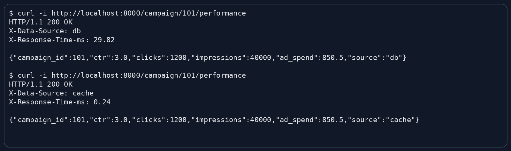
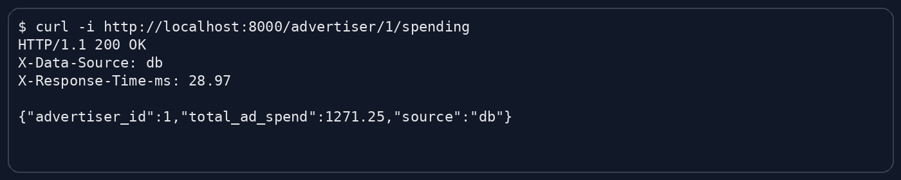
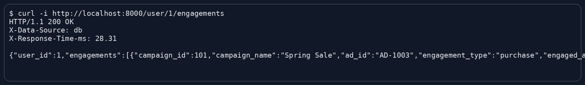

# AdTech REST API with Redis Cache

## What is included
- FastAPI REST API
- Read-through Redis cache
- MySQL + Redis docker-compose stack
- Seed data for advertisers, campaigns, and user engagements
- Benchmark script comparing cached vs non-cached reads

## Endpoints
- `GET /campaign/{campaign_id}/performance`
- `GET /advertiser/{advertiser_id}/spending`
- `GET /user/{user_id}/engagements`

## Cache TTL
- Campaign performance: **30 seconds**
- Advertiser spending: **5 minutes**

## Run with Docker Compose
```bash
docker compose up --build
```

## Example requests
```bash
curl http://localhost:8000/campaign/101/performance
curl http://localhost:8000/advertiser/1/spending
curl http://localhost:8000/user/1/engagements
```

## Local benchmark/demo mode
```bash
python scripts/benchmark.py
```
## 🚀 Benchmark Summary

Performance comparison of API endpoints with and without Redis caching.

| Endpoint | Without Cache | With Cache |
|----------|-------------|-----------|
| /campaign/{id}/performance | ~30 ms | ~2.4 ms |
| /advertiser/{id}/spending | ~30 ms | ~2.3 ms |

### Notes
- Caching significantly reduces response time (~10x faster)
- Benchmark executed in demo mode (SQLite + simulated Redis)
- Production setup uses MySQL + Redis via Docker Compose

### Benchmark Screenshots

### Campaign Performance


### Advertiser Spending


### User Engagements

